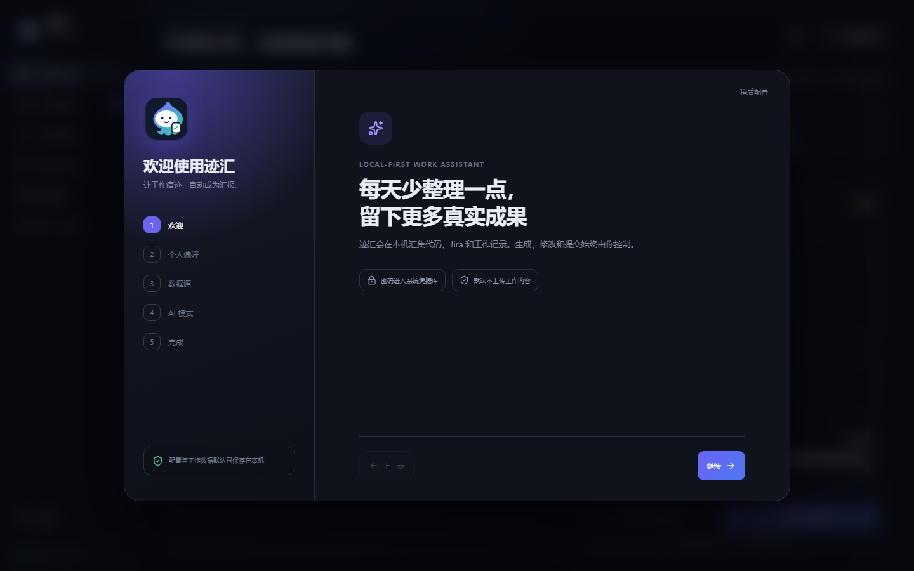

# 迹汇 TraceFlow

让工作痕迹，自动成为汇报。

迹汇是一款本地优先的桌面工作助手。它帮助你汇集当天真实工作记录，生成日报、周报、工时建议和汇报材料。所有提交动作都由用户确认，默认不依赖中心服务器。



> 当前项目处于早期开发阶段。自动采集、Jira 工时和企业微信提交能力仍在逐步实现，请勿将当前版本用于无人值守的生产提交。

## 迹汇能做什么

- 监控当前活动窗口并自动聚合工作主题，低置信记录无需逐条确认
- 按项目整理代码、文档、PPT、Codex、业务平台和手动补充的工作记录
- 17:50 生成日报草稿，18:00 后经确认再提交
- 默认每日 8 小时，支持调整工时和中国法定节假日规则
- 生成日报、周报、月报及 PPT 汇报素材
- 使用自己的 AI API、本地模型，或导出给 Codex 等工具
- 在“汇报中心”导入旧日报，并在本机加密保存
- 经授权后优先用 UI Automation 读取当前企业微信汇报；读取不到且单独授权时才使用本地 OCR
- 企业管理员可配置企业 ID 和汇报应用 Secret，通过企业微信官方接口批量读取历史汇报
- 通过离线分享码或配置文件共享设置，不需要中心服务器
- 使用“小鱿”在首次引导、生成和提交状态中提供提示

## 5 分钟上手

正式安装包发布后：

1. 从 GitHub Releases 下载 Windows 安装包。
2. 双击安装并启动“迹汇 TraceFlow”。
3. 首次向导只需确认工作时间、是否开启本机监控和生成方式；全部保持默认也可直接开始。
4. 项目和外部服务可以稍后配置，不会阻挡自动整理。
5. 每天下班前检查小鱿整理的草稿，确认后再提交。

左侧只保留“今日、工作记录、汇报中心、项目”四个核心入口，设置固定在底部。页面独立切换，不需要滚动寻找功能。

## 历史日报与企业微信

- 点击“汇报中心”→“导入历史日报”，填写日期、工作总结和下一步计划；确认后正文加密保存到本机数据库。
- 点击“汇报中心”→“从企业微信导入”，可读取当前窗口、粘贴内容，或使用管理员授权的官方接口读取历史汇报。
- 自动读取前，需在“设置 → 自动整理”单独开启 UI Automation。它只读取当前活动的企业微信窗口；本地 OCR 默认关闭，必须再次授权，识别完成后默认立即删除原图。
- 当前版本不自动提交企业微信汇报；识别结果和导入内容必须由用户检查确认。

第一版安装包暂未进行商业代码签名，Windows 可能提示“未知发布者”。请只从本仓库 Releases 下载，并对照发布页中的 SHA-256 校验值。

## 数据安全与隐私

- 工作数据默认只保存在本机，不建设中心数据服务。
- 本地接口只监听 `127.0.0.1`。
- 密码和令牌应保存到 Windows 凭据管理器或 macOS 钥匙串。
- 数据源默认只采集元数据，正文采集需要用户主动授权。
- 在线 AI 请求前应展示将要发送的内容并支持脱敏。
- 使用统计只保存在本机，不记录工作正文，用户可以关闭或清空。
- 分享码自动排除姓名、密码、令牌、Cookie、报告和历史记录。

完整说明请阅读 [隐私与数据安全](docs/隐私与数据安全.md)。

## 离线配置分享

迹汇支持两种完全离线的配置分享方式：

- 普通分享码：便于复制，包含完整性校验。
- 密码分享码：使用 PBKDF2 派生密钥，并通过 AES-256-GCM 加密。

分享码可能包含平台地址和项目映射。导出前请确认接收者可信，不要把公司配置发布到公开 Issue、论坛或聊天群。

## 获取帮助

- 使用问题和功能建议：提交 GitHub Issue。
- 安全或隐私问题：按照 [安全策略](SECURITY.md) 发送邮件至 `1606812961@qq.com`。
- 常见故障：查看 [故障排查](docs/故障排查.md)。

提交反馈前请删除账号、内网地址、截图中的工作内容和其他敏感信息。

## 本地开发

需要 Java 21、Node.js 22、Rust stable。Windows 桌面构建还需要 Visual Studio C++ Build Tools。

后端：

```powershell
cd backend
./mvnw.cmd spring-boot:run
```

前端：

```powershell
cd frontend
npm ci
npm run dev -- --host 127.0.0.1 --port 1420
```

桌面开发模式：

```powershell
cd frontend
npm run desktop:dev
```

## 验证

```powershell
cd backend
./mvnw.cmd test

cd ../frontend
npm test -- --run
npm run lint
npm run build

cd src-tauri
cargo test
```

## 技术架构

- 桌面程序：Tauri 2
- 界面：React 19、TypeScript、Vite
- 本地后端：Java 21、Spring Boot
- 本地数据库：SQLite、Liquibase
- 进程关系：Tauri 启动并管理本地 Java 后端

## 参与贡献

欢迎提交 Issue 和 Pull Request。开始前请阅读 [贡献指南](CONTRIBUTING.md) 和 [社区行为准则](CODE_OF_CONDUCT.md)。

公司内网 URL、内部页面选择器、项目映射和真实工作内容不得提交到公开仓库。

## 许可证

迹汇采用 [Apache License 2.0](LICENSE) 开源。
